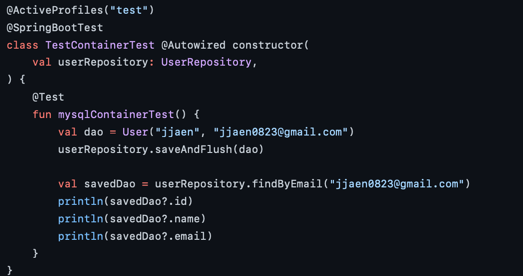
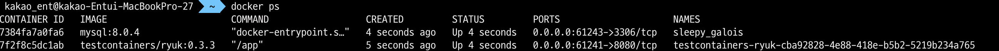
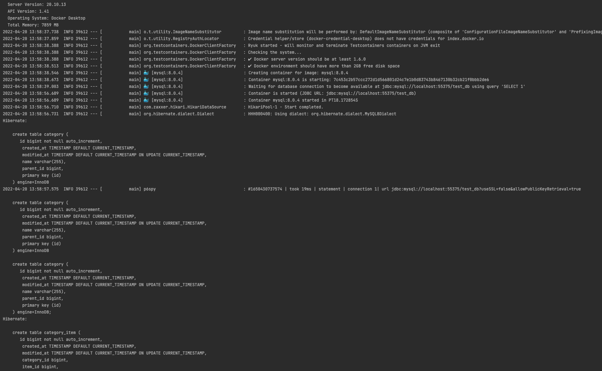
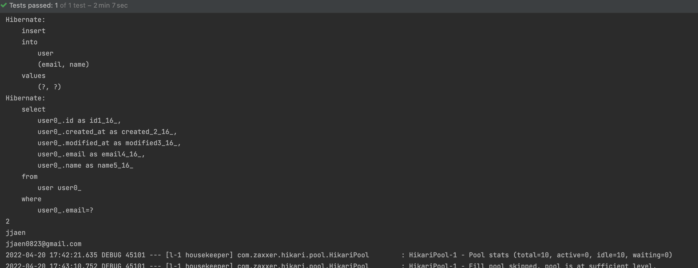

# [ Test Container ]
> 개발 환경에서 사용하는 DB는 stateful하기 때문에, 테스트 DB로 같이 사용하기 쉽지 않다. 
  테스트는 여러 번 실행시켜도 동일한 동작을 해야하기 때문에 stateless하게 DB를 테스트 할 수 있는 환경이 필요하다.
  H2는 ddl 호환이 안 되는 경우가 있기 때문에 mysql test container를 사용하도록 구축해야 한다.
  
  TestContainer 도커로 mysql 컨테이너를 띄우고 테스트를 진행한 후 컨테이를 종료하기 때문에 stateless하게 매 테스트를 진행할 수 있다.

stateless -> 여러 번 실행하도 동일한 동작으로 해야 한다
DB는 stateful하기 때문에 

어떻게 stateless하게 DB를 테스트 하는가?
보통 스프링부트에서 H2를 사용해서 인메모리로 사용한다.
릴레이션을 강하게 쓰고 있어서 일부 H2와 호환이 안되는 경우가 많다.

testcontainer 란?
stateless -> 여러 번 실행하도 동일한 동작으로 해야 한다
DB는 stateful하기 때문에 

## 1. test container 실행을 위한 application.yaml 파일 설정
  - mysql test container 사용
    ```yaml
    spring:
      datasource:
        hikari:
          driver-class-name: org.testcontainers.jdbc.ContainerDatabaseDriver
          jdbc-url: jdbc:tc:mysql:8.0.4://localhost:3306/test_db?user=test&password=1234&TC_INITSCRIPT=schema.sql
          connection-init-sql: SELECT 1
  
      jpa:
        database-platform: org.hibernate.dialect.MySQL8Dialect
        show-sql: true
        hibernate.ddl-auto: none
        properties.hibernate.format_sql: true
  
      config:
        activate:
          on-profile: test
    ```

## 2.구동 확인
### 2.1 test container를 적용할 class에 다음 Annotation 적용
  ```
  @ActiveProfiles("test")
  ```
  

### 2.2 테스트 실행
  

### 2.3 test container DDL
  

### 2.4 테스트 확인
  

  


<br>
