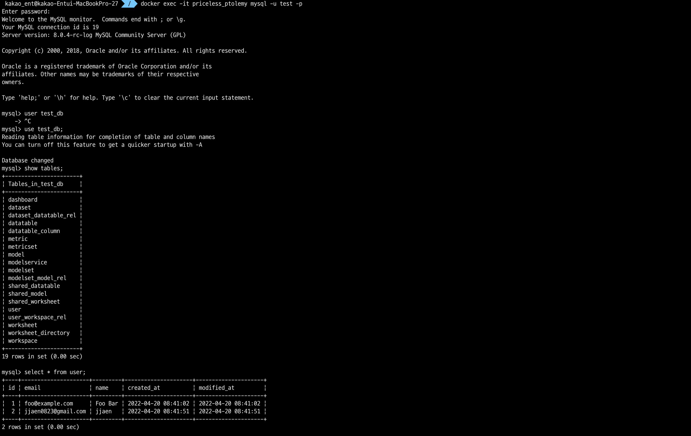

# [ Test Container ]
## 1. test container 실행을 위한 application.yaml 파일 설정
  - mysql test container 사용
    ```yaml
    spring:
      datasource:
        hikari:
          driver-class-name: org.testcontainers.jdbc.ContainerDatabaseDriver
          jdbc-url: jdbc:tc:mysql:8.0.4://localhost:3306/test_db?user=test&password=1234&TC_INITSCRIPT=schema.sql
          connection-init-sql: SELECT 1
  
      jpa:
        database-platform: org.hibernate.dialect.MySQL8Dialect
        show-sql: true
        hibernate.ddl-auto: none
        properties.hibernate.format_sql: true
  
      config:
        activate:
          on-profile: test
    ```

## 2.구동 확인
### 2.1 test container를 적용할 class에 다음 Annotation 적용
  ```
  @ActiveProfiles("test")
  ```
  

### 2.2 테스트 실행
  

### 2.3 test container DDL
  

### 2.4 테스트 확인
  

  


<br>
